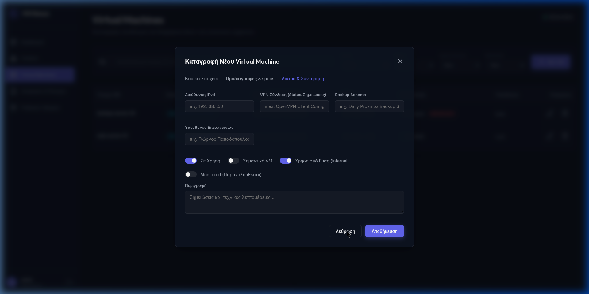
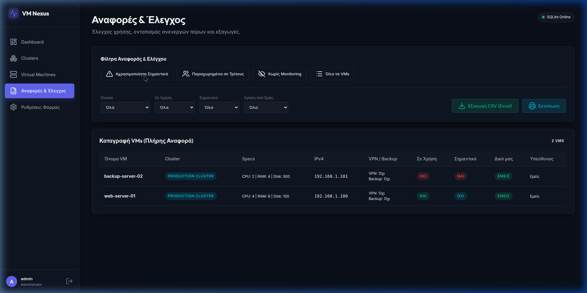

# InfraAtlas

**InfraAtlas** είναι μια σύγχρονη, ελαφριά και αυτόνομη εφαρμογή (Single Page Application - SPA) για την ολοκληρωμένη καταγραφή, διαχείριση, παρακολούθηση και έλεγχο Υποδομών (Clusters), Εικονικών Μηχανών (Virtual Machines) και Εγγραφών DNS (A & CNAME). 

Αναπτύχθηκε σε **Go** για μέγιστη απόδοση και χαμηλή κατανάλωση πόρων, σε συνδυασμό με ένα **Glassmorphic Dark UI** σχεδιασμένο σε Vanilla CSS και JavaScript.

---

## 🚀 Χαρακτηριστικά (Features)

### 1. 📊 Επισκόπηση & Dashboard
- **Δυναμικά Γραφήματα & Μετρητές**: Προβολή συνολικής κατάστασης υποδομής, ενεργών VMs, παρακολουθούμενων συστημάτων (Monitored) και Σημαντικών VMs.
- **Υπολογισμός Συνολικών Πόρων**: Δυνατότητα ορισμού των συνολικών διαθέσιμων πόρων της υποδομής (CPU, RAM, Disk, IPs) στις *Ρυθμίσεις* για αυτόματο υπολογισμό ποσοστών χρήσης.
- **VMs που Χρειάζονται Αναβάθμιση**: Ειδικό panel στο Dashboard που εμφανίζει άμεσα τα VMs που εκκρεμεί αναβάθμιση Λειτουργικού (OS) ή Λογισμικού (App), με δυνατότητα άμεσου κλικ για επεξεργασία.

### 2. 📦 Διαχείριση Clusters & Πόρων
- Καταγραφή και παρακολούθηση συμπλεγμάτων (Clusters).
- Αυτόματος υπολογισμός συνολικών πόρων ανά cluster: **CPU**, **RAM (GB)**, **Storage (GB)**, **Extra Storage (GB)**.
- Οπτικοποίηση κατανομής VM και κατάστασης χρήσης.

### 3. 🖥️ Πλήρης Καταγραφή Εικονικών Μηχανών (VMs)
- Λεπτομερής παρακολούθηση πεδίων:
  - **Ταυτότητα**: Όνομα, URL (με υποστήριξη πολλαπλών domains), Κατάσταση Χρήσης (`In Use`), Σημαντικότητα (`Is Important`).
  - **Πόροι**: CPU Cores, RAM (GB), Κύριος Δίσκος (GB), Extra Δίσκος (GB).
  - **Δίκτυο & Πρόσβαση**: IPv4 Address, IPv6 Address, VPN Access (Ναι/Όχι).
  - **Κατάσταση & Αναβαθμίσεις**: Backup Status, Monitoring (`Monitored`), Λειτουργικό Σύστημα (`OS & OS Version`), **Αναβάθμιση Λειτουργικού (OS Upgrade)**, **Αναβάθμιση Λογισμικού (App Upgrade)**.
  - **Διοικητικά**: Υπεύθυνος Επικοινωνίας (Contact Person), Περιγραφή / Σημειώσεις.
- Φιλτράρισμα & Αναζήτηση σε πραγματικό χρόνο (ανά όνομα, IP, URL, OS, υπεύθυνο).

### 4. 📄 Μαζική Εισαγωγή VMs από CSV (Bulk Import)
- Εισαγωγή αρχείων CSV (π.χ. `ΕΕΛΛΑΚ-systems.ods.csv`) με αυτόματη αναγνώριση ενοτήτων/headers για ανάθεση σε Clusters.
- **Smart Parsing & Upsert**: Δημιουργεί αυτόματα νέα Clusters αν δεν υπάρχουν και ενημερώνει/εισάγει VMs χωρίς διπλότυπες εγγραφές.

### 5. 🌐 Διαχείριση Εγγραφών DNS (A & CNAME)
- Πλήρης καταγραφή εγγραφών DNS (Domain, Τύπος εγγραφής A/CNAME, Τιμή/IP).
- **Zone File Import**: Αυτόματη αναγνώριση και εισαγωγή εγγραφών απευθείας από BIND zonefiles.
- Ταξινόμηση στηλών (Sorting) κατά αύξουσα/φθίνουσα σειρά με ένα κλικ.

### 6. 🔍 Αναφορές & Έλεγχος Υποδομής (Reports & Auditing)
- **DNS χωρίς VM (Προς Διαγραφή)**: Ακριβής αλγόριθμος ταύτισης IPs & Domains που εντοπίζει ορφανές εγγραφές DNS (A & CNAME) που δεν αντιστοιχούν σε κανένα ενεργό VM, επιτρέποντας την άμεση διαγραφή τους.
- **VMs χωρίς DNS (Προς Διαγραφή)**: Εντοπισμός εικονικών μηχανών που δεν διαθέτουν αντιστοιχισμένη εγγραφή DNS.
- **Εξαγωγή & Εκτύπωση**: Εξαγωγή αναφορών σε αρχείο **CSV (Excel)** και λειτουργία εκτύπωσης / Print-friendly view.

### 7. 🔐 Ασφάλεια & Διαχείριση Προφίλ / Ρυθμίσεων
- Αρχικό setup λογαριασμού διαχειριστή κατά την πρώτη εκκίνηση.
- Ασφαλής αυθεντικοποίηση με HTTP-only Session Cookies και **bcrypt password hashing**.
- Διαχείριση προφίλ (αλλαγή Username/Password) και περιοχή συνολικών **Ρυθμίσεων Υποδομής**.

---

## 🛠️ Τεχνολογικό Στοίβαγμα (Tech Stack)

- **Backend**: Go (Golang 1.25+)
  - `net/http` standard library.
  - Embedded static asset file server (`embed`).
  - `modernc.org/sqlite` (Pure Go CGO-free SQLite driver).
- **Frontend**: Single Page Application (SPA)
  - Vanilla HTML5 / Vanilla CSS3 (Glassmorphism dark design system, CSS Variables, Responsive layout).
  - Vanilla JavaScript (Async Fetch API, dynamic components).
  - Google Fonts (`Inter`, `JetBrains Mono`) & Lucide Icons.
- **Containerization**: Docker & Docker Compose (Multi-stage build).

---

## 🐳 Γρήγορη Εκκίνηση με Docker (Quick Start)

### 1. Κλωνοποίηση του Αποθετηρίου
```bash
git clone https://github.com/iosifidis/InfraAtlas.git
cd InfraAtlas
```

### 2. Εκκίνηση με Docker Compose
```bash
docker compose up --build -d
```

Η εφαρμογή θα είναι διαθέσιμη στη διεύθυνση: **`http://localhost:8080`**

---

## 📂 Δομή Αρχείων Έργου

```text
InfraAtlas/
├── main.go               # Σημείο εισόδου & δρομολόγηση HTTP routes
├── handlers.go           # Handlers για API endpoints (Auth, Clusters, VMs, DNS, CSV, Settings)
├── db.go                 # Σχήμα SQLite & CRUD λειτουργίες βάσης
├── Dockerfile            # Multi-stage Docker build file
├── docker-compose.yml    # Docker Compose configuration με bind volume & project name
├── go.mod / go.sum       # Εξαρτήσεις Go modules
├── static/               # Frontend Assets
│   ├── index.html        # SPA Main Interface
│   ├── style.css         # Custom Glassmorphic Dark Design System
│   └── app.js            # Frontend Logic Controller & Report Generator
└── data/                 # SQLite Database Volume (/app/data/dashboard.db)
```

---

## 💾 Αποθήκευση Δεδομένων (Data Persistence)

Η βάση δεδομένων SQLite αποθηκεύεται στον κατάλογο `./data/dashboard.db` του host μηχανήματος μέσω Docker Bind Volume.
Αυτό διασφαλίζει ότι όλα τα δεδομένα παραμένουν ανέπαφα ακόμα και κατά την επανεκκίνηση ή αναβάθμιση του container.

---

## 📸 Screenshots





---

## 📜 Άδεια Χρήσης (License)

Το **InfraAtlas** είναι ελεύθερο λογισμικό και διατίθεται υπό την άδεια **GNU Affero General Public License v3.0 (AGPL-3.0)**. 
Δείτε το αρχείο [LICENSE](LICENSE) για περισσότερες λεπτομέρειες.
